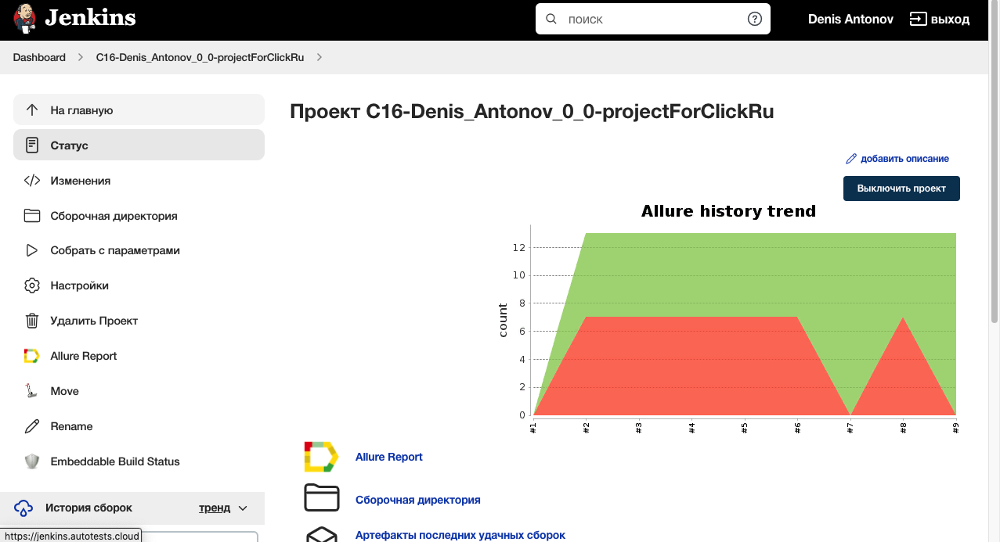
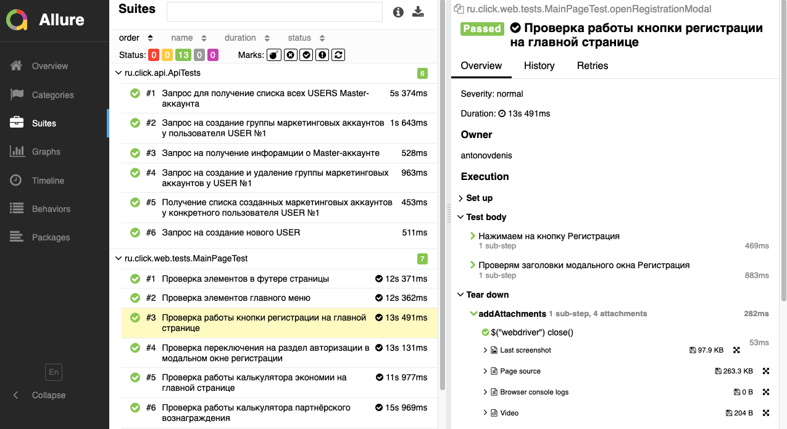
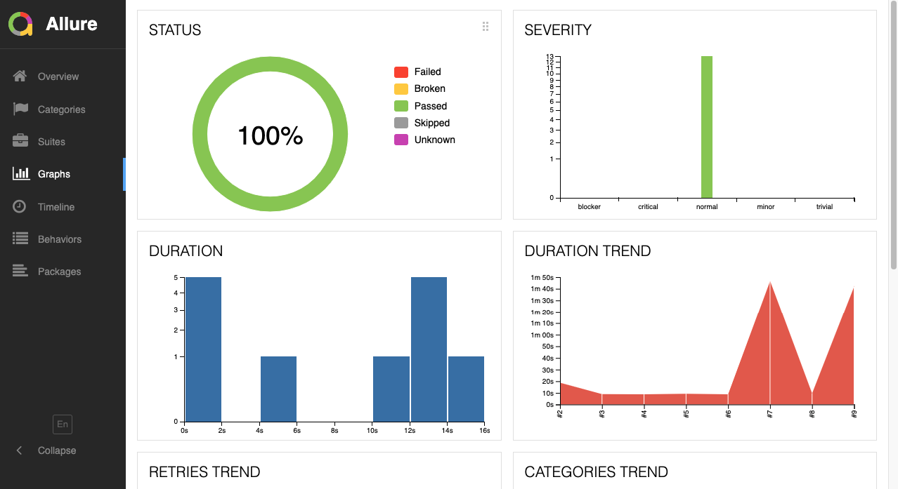
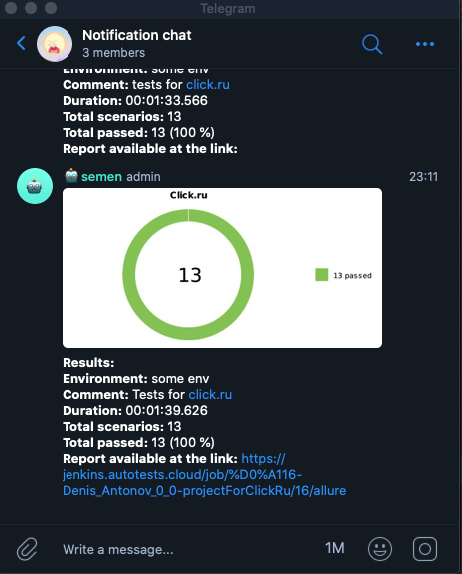
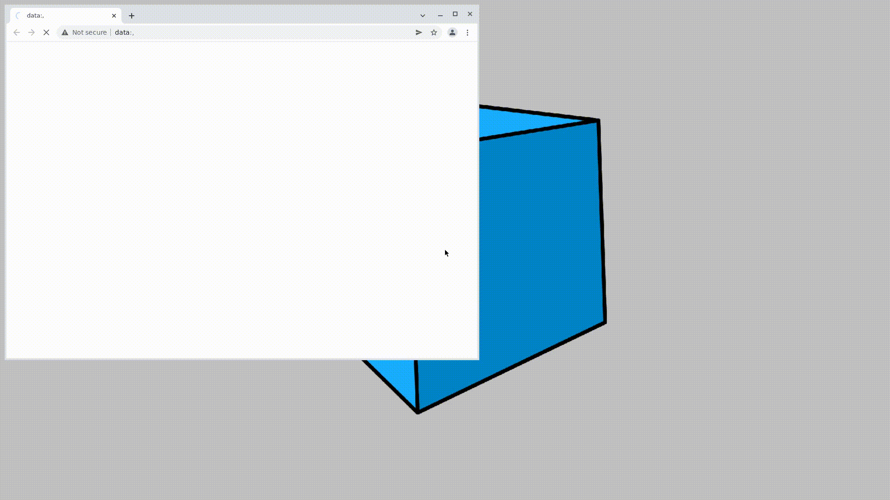

# Проект по автоматизации тестирования для Click.ru
<a target="_blank" href="https://click.ru">Веб-сайт Click.ru</a>

## :scroll: Содержание:

* <a href="#stack">Используемые технологии</a>
* <a href="#verifications">Реализованные проверки</a>
* <a href="#jenkins-build">Параметры сборки в Jenkins</a>
* <a href="#terminal-run">Запуск тестов из терминала</a>
* <a href="#allure-report">Allure отчет</a>
* <a href="#allure-TestOps">Интеграция с Allure TestOps</a>
* <a href="#jira">Интеграция с Jira TestOps</a>  
* <a href="#telegram-notification">Отчет в Telegram</a>
* <a href="#selenoid-video">Видео примеры прохождения тестов</a>

<a id="stack"></a>
## 🔧 Используемые технологии:

<p align="center">
<a href="https://www.jetbrains.com/idea/"></a>
<a href="https://www.java.com/"></a>
<a href="https://github.com/"></a>
<a href="https://junit.org/junit5/"></a>
<a href="https://gradle.org/"></a>
<a href="https://selenide.org/"></a>
<a href="https://aerokube.com/selenoid/"></a>
<a href="https://github.com/allure-framework/allure2"></a>
<a href="https://www.jenkins.io/"></a>
<a href="https://qameta.io/"></a>
<a href="https://www.java.com"></a>
<a href="https://www.atlassian.com/ru/software/jira"></a>
<a href="https://rest-assured.io/"></a>
</p>

<a id="verifications"></a>
## :clipboard: Реализованные проверки:

# Web UI
- ✓ Проверка элементов главного меню.
- ✓ Проверка элементов меню в футере страницы.
- ✓ Проверка работы кнопки регистрации на главной странице.
- ✓ Проверка переключения на раздел Демо в модальном окне регистрации.
- ✓ Проверка переключения на раздел авторизации в модальном окне регистрации.
- ✓ Проверка работы калькулятора экономии на главной странице.
- ✓ Проверка работы калькулятора партнёрского вознаграждения.

## API
- ✓ Проверка получения списка всех USERS Master-аккаунта.
- ✓ Проверка возможности создания нового USER.
- ✓ Проверка получения инфорамции о Master-аккаунте.
- ✓ Проверка получения списка созданных маркетинговых аккаунтов у конкретного пользователя.
- ✓ Проверка создания группы маркетинговых аккаунтов у конкретного пользователя.
- ✓ Проверка удаления группы маркетинговых аккаунтов у конкретного пользователя.


## </a> Jenkins job
<a target="_blank" href="https://jenkins.autotests.cloud/job/С16-Denis_Antonov_0_0-projectForClickRu/">Сборка в Jenkins</a>
<p align="center">
<a href="https://jenkins.autotests.cloud/job/С16-Denis_Antonov_0_0-projectForClickRu/"></a>
</p>

<a id="jenkins-build"></a>
### Параметры сборки в Jenkins:

- Локальный запуск
- Удаленный запуск

<a id="terminal-run"></a>
## :computer: Запуск тестов из терминала

Локальный запуск:
```bash
gradle clean test -Denv=local
```

Удаленный запуск в Jenkins:
```bash
gradle clean test -Denv=remote
```

<a id="allure-report"></a>
## </a> Отчет в <a target="_blank" href="https://jenkins.autotests.cloud/job/https://jenkins.autotests.cloud/job/С16-Denis_Antonov_0_0-projectForClickRu/16/allure/#">Allure report</a>

### Основное окно

<p align="center">

</p>

### Тесты

<p align="center">

</p>

### Графики

<p align="center">

</p>


<a id="allure-TestOps"></a>
## </a> Интеграция с Allure TestOps

<p align="center">

</p>

<a id="telegram-notification"></a>
## </a> Уведомление в Telegram

<p align="center">

</p>

<a id="selenoid-video"></a>
### </a> Видео о прохождении тестов

<p align="center">
 
</p>